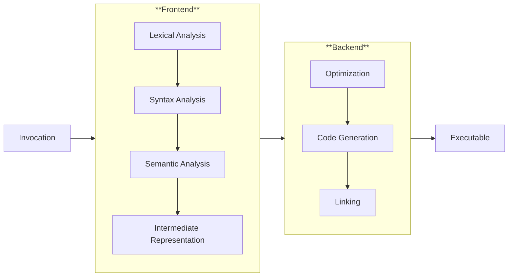
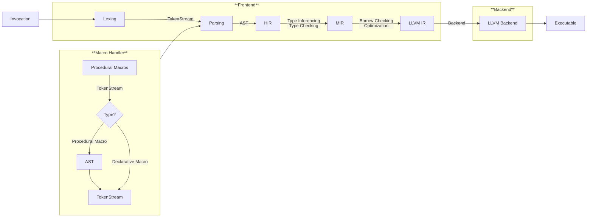

# About Rust
`rustc` is what makes Rust great!

---
level: 2
---
# Why Rust?
When we talk about Rust, we refer to words like **memory safety**, **efficiency**, **expressiveness**, **open-source** and so on... Nowadays, when we talk about system safety, we can't avoid mentioning Rust.
### What makes Rust different from other languages?
Rust Compiler `rustc` may give you the answers.
<v-click> 
<li> 🛠 It has a very powerful frontend system whereas the backend is backed up by the famous LLVM. (The same backend for compilers like clang/intel DPC/C++ compilers)</li>
<li> 🤔 The explicit definition of ownership enables the compiler to perform static analysis on the code, resolving issues only using frontend. </li>
</v-click>
---
level: 2
---
# Compiling Rust
<v-switch>
  <template #1>
    <h3> A general compiler flow </h3>
     
    

    

  </template>
  <template #2>
    <h3> Rust Compiler Flow </h3>
     
    

    

  </template>
</v-switch>