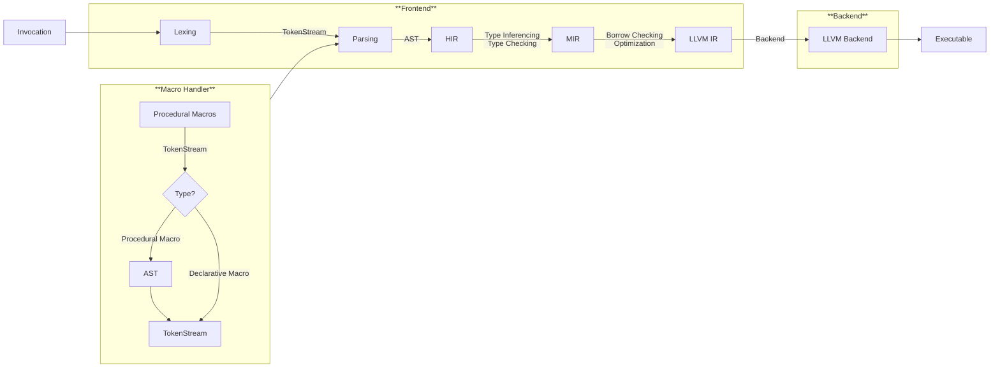
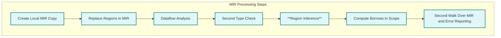

# Ownership and Lifetime in Rust
Using this, we try to demonstrate how static analysis works.

---
level: 2
---
# Preface
Good prgrammers select language, while great language selects programmers.

**Ownership** and **lifetimes** are core concepts in the Rust language. In fact, these concepts exist not only in Rust but also in C/C++. Nearly all memory safety issues stem from the incorrect use of ownership and lifetimes. Any programming language that does not use garbage collection to manage memory faces these challenges. 

<v-click>
However, Rust <span v-mark.underline.orange="1">explicitly</span> defines these concepts at the language level and provides language features that allow users to explicitly <span v-mark.underline.orange="1">control ownership transfer</span> and <span v-mark.underline.orange="1">declare lifetimes</span>.  Additionally, the compiler checks for various misuse errors, enhancing the program's memory safety.
</v-click>
<br>
<br>
<v-click>
I believe that these concepts are still way too abstract to understand. But I also believe most of us encounter problems like <code>segmentation fault</code>, <code>dangling pointer</code>, <code>buffer overflow</code>, etc. in our daily programming. These problems are all related to memory safety.
</v-click>

---
level: 2
---
# A Simple Example
Write you a Rust for safe

**Ownership** means control over a memory region associated with a variable. This region can exist in various memory locations (like heap, stack, or code segment). In high-level languages, accessing these memory regions typically requires associating them with variables, unlike in low-level languages where direct access is possible.

````md magic-move {lines: true}
```cpp {*|6-7}
#include <iostream>
using namespace std;

int main() {
    int values[3]= { 1,2,3 };
    cout<<values[0]<<","<<values[3]<<endl;
    // Buffer overflow
    return 0;
}
```

```cpp {*|12-13}
#include <iostream>
using namespace std;

struct Point { int x; int y; };

Point* newPoint(int x,int y) {
    Point p { .x=x, .y=y };  return &p;
}

int main() {
    Point *p = (Point*)malloc(sizeof(Point));
    cout<<p->x<<","<<p->y<<endl;
    // Segmentation fault
    return 0;
}
```

```cpp {*|12-13}
#include <iostream>
using namespace std;

struct Point { int x; int y; };

Point* newPoint(int x,int y) {
    Point p { .x=x, .y=y };  return &p;
}

int main() {
    Point p = NULL;
    cout<<p->x<<endl;
    // Dereferencing null pointer
    return 0;
}
```

```cpp {*|12-13}
#include <iostream>
using namespace std;

struct Point { int x; int y; };

Point* newPoint(int x,int y) {
    Point p { .x=x, .y=y };  return &p;
}

int main() {
    Point *p = newPoint(10,10);
    delete p;
    // Dangling pointer and Invalid memory deallocation
    return 0;
}
```
````

---
level: 2
---
# How do Rust cope with such problems?
From C++ to Rust

In Rust, the **ownership** concept comes with binding instead of assigning likewise in C++.

````md magic-move {lines: true}
```cpp
#include <iostream>

int main()
{
    int a = 1;
    std::cout << &a << std::endl;   /* 0x62fe1c */
    a = 2;
    std::cout << &a << std::endl;   /* 0x62fe1c */
}
// In this case, the address of `a` remains the same. We are assigning values to `a`.
```
    
```rust
fn main() {
    let a = 1; // Creating an immutable binding
    println!("a:{}",a);     /* 1 */
    println!("&a:{:p}",&a); /* 0x9cf974 */
    a = 2;                /* Error: cannot assign twice to immutable variable `a` */
    let a = 2;              /* Rebinding */
    println!("&a:{:p}",&a); /* 0x9cf9a4 */ 
}
// In this case, the address of `a` changes.
// An immutable binding means that a variable is bound to a memory address and given ownership.
```

```rust {*|2}
fn main() {
    let mut b = 1; // Creating a mutable binding
    println!("b:{}",b);     /* 1 */
    println!("&b:{:p}",&b); /* 0x9cfa6c */
    b = 2;
    println!("b:{}",b);     /* 2 */
    println!("&b:{:p}",&b); /* 0x9cfa6c */
    let b = 2;              /* Rebinding */
    println!("&b:{:p}",&b); /* 0x9cfba4 */
}
// In this case, the address of `b` remains the same.
// A mutable binding allows the variable to modify the data in the associated memory region.
```
````
<v-click>
<b>Assignment</b> is the act of writing a value into the memory region associated with a variable, while <b>binding</b> is the process of establishing the relationship between a variable and a memory region. In Rust, this also involves transferring ownership of that memory region to the variable.
</v-click>

---
level: 2
---
# Ownership Transfer and Borrowing
Transfer or Borrow?

With binding concepts, Rust transfers ownership of a memory region to a variable. This transfer is called **ownership transfer**. Transfer of ownership avoids copying the data, which will be more efficient. If we just want to use the data without transferring ownership, we can borrow the data. This is called **borrowing**.

````md magic-move {lines: true}
```rust
fn main() {
    let a = 1;
    let b = a; // Ownership transfer
    println!("a:{}",a); /* Error: use of moved value: `a` */
    println!("b:{}",b); /* 1 */
}
```

```rust
fn main() {
    let mut a = 1;
    let im_ref = &a;        // Unmutable borrowing
    let mut_ref = & mut a;  // Mutable borrowing
    println!("{}",im_ref); 
    //[At line 4] error[E0502]: cannot borrow `a` as mutable because it is also borrowed as immutable
}
```

```rust
fn main() {
    let mut a = 1;
    let mut_ref = & mut a;  // Mutable borrowing
    println!("{}",a);
    println!("{}",mut_ref); 
    //[At line 5] error[E0507]: cannot move out of `a` because it is borrowed
}
```
````
<div v-click="2">
In the first example, the ownership of <code>a</code> is transferred to <code>b</code>. Therefore, <code>a</code> cannot be used after the transfer. In the second example, <code>im_ref</code> and <code>mut_ref</code> are borrowed from <code>a</code>. The ownership of <code>a</code> is not transferred, so <code>a</code> can still be used. However, <code>mut_ref</code> cannot be used before <code>im_ref</code> is released. 
</div>
<div v-click="3">
In Rust, the compiler checks for ownership transfer and borrowing. If the code violates these rules, the compiler will throw an error. This is called <span v-mark.underline.orange="2">static analysis</span>.
</div>

---
level: 2
---
# Borrow Checker in Rust Compilers
ref: [Rust Compiler Development Guide](https://rustc-dev-guide.rust-lang.org/borrow_check.html) 

<v-switch>

<template #1>
The borrow checker operates on the MIR, an older implementation operated on the HIR.


</template>
<template #2>

The borrow checker source is located in the [`rustc_borrowck`](https://doc.rust-lang.org/nightly/nightly-rustc/rustc_borrowck/index.html) crate. The main entry point is the `mir_borrowck` query.


During `Region Inference` process, the compilers will conduct:
- Constraint Propagation
- Lifetime Parameters Checking
- Member Constraints Checking
- ...

</template>

</v-switch>


---
level: 2
---
# Lifetime
How long does the data live? How does Rust compiler analyze it?

The lifecycle of a variable is mainly related to its scope, and in most programming languages, it is implicitly defined. In Rust, however, you can explicitly declare the lifetime parameters of variables, which is a very unique design. This syntactic feature is something that is rarely seen in other languages.
    
````md magic-move {lines: true}
```rust
struct V{v:i32}
 
fn bad_fn() -> &V{ 
    let a = V{v:10};
    &a
}

fn main(){
    let res = bad_fn();   
}
// [At line 3] error[E0106]: missing lifetime specifier
```

```rust
struct V{v:i32}

fn bad_fn<'a>() -> &'a V{
    let a = V{v:10};
    let ref_a = &a;
    ref_a   
}

fn main(){
    let res = bad_fn();   
}
// [At line 6] error[E0515]: cannot return reference to local variable `a` -> Dangling pointer
```
````
<v-switch>
<template #1> The <code>'a</code> lifetime parameter in Rust specifies the required lifespan of a reference returned by a function, ensuring that the returned reference is valid within the caller's context. </template>
<template #2><code>'a</code> imposes a requirement on the reference returned within the function body: the data referred to by the returned reference must have a lifetime at least as long as <code>'a</code>, meaning it must last at least as long as the variable in the caller context that receives the return value. </template>
</v-switch>

---
level: 2
---
# More about Lifetime

<v-switch>
<template #1>

## Static Lifetime

```rust
fn get_str<'a>() -> &'a str { // Also can be written as <'static>
    let s = "hello";
    s
}
```

In this case, the lifetime of the string `s` is static, meaning it lasts for the entire program execution. The lifetime of the string is not bound by any specific scope.

</template>
<template #2>

## Lifetime in function
```rust
fn echo<'a, 'b>(content: &'b str) -> &'a str {
    content
}
fn longer<'a, 'b>(s1: &'a str, s2: &'b str) -> &'a str {
    if s1.len() > s2.len()
        { s1 }
    else
        { s2 }
}
// error: lifetime may not live long enough
```
```rust
fn echo<'a, 'b: 'a>(content: &'b str) -> &'a str {
    content
}
fn longer<'a, 'b: 'a>(s1: &'a str, s2: &'b str) -> &'a str {
    if s1.len() > s2.len()
        { s1 }
    else
        { s2 }
}
// Mark that 'b is at least as long as 'a
```
</template>
<template #3>

## Lifetime in struct

```rust
struct G<'a>{ m:&'a str}
 
fn get_g() -> () {
    let g: G;
    {
        let  s0 = "Hi".to_string();
        let  s1 = s0.as_str();
        g = G{ m: s1 };
    }
    println!("{}", g.m);
}
```
The lifetime definition of a struct ensures that, within an instance of the struct, the lifetime of its reference members is at least as long as the lifetime of the struct instance itself.

</template>
</v-switch>

---
level: 2
---
# Lifetime Checker in Rust Compilers
In a function definition, the compiler does not know what the actual calling context of the function will be in the future. The lifetime parameters essentially serve as a **contract** between the function context and the caller context regarding the lifetimes of the parameters.
<v-switch>
<template #1>

### Lifetime checking in the function definition context

The return value's lifetime annotation in a function signature can be any of the input annotations, as long as it ensures that **the temporary variable derived from the input parameters has a lifetime equal to or longer than the return value's lifetime annotation** in the function signature. 

```rust
fn bad_fn<'a>() -> &'a V{
    let a = V{v:10};
    let ref_a = &a;
    ref_a
}
```

</template>
<template #2>

### Lifetime checking in the caller context

In the caller context, the variable `res` that receives the borrowed value returned by the function cannot have a lifetime longer than the lifetime of the returned borrow (which is derived from the input borrowed parameters). Otherwise, `res` would become a dangling pointer after the input parameters go out of scope.

```rust
let res: &str;
{
    let s = String::from("reload");
    res = remove_prefix(&s, "re") // s us out of scope
}
println!("{}", res);
```

</template>
</v-switch>
