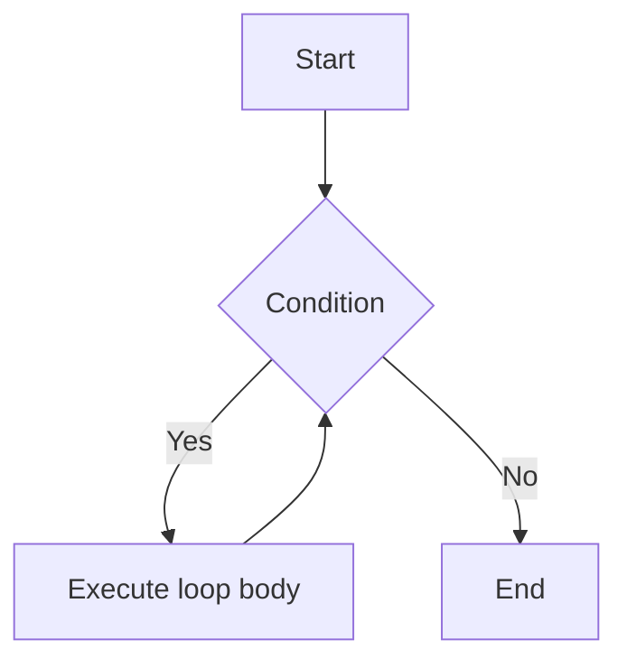

# Control Statements

---
level: 2
---
# A Jokey Example 
来点程序员笑话

- 我妈: 回来的时候买两盒鸡蛋, 如果看到牛奶就买一盒
- 我: 好的
...过了一会儿...
- (拿着一盒鸡蛋) 我: 妈, 我回来了
- 我妈: 你怎么只买了一盒鸡蛋?
- 我: 我看到牛奶了

---
level: 2
---
# If Statement
如果, 我是说如果

从If, 到If-Else, 再到If-Else-If, 只会执行一个分支

````md magic-move {lines: true}
```java
if (condition) {
    // do something
}
```

```java
if (condition) {
    // do A
} else {
    // do B
}
```

```java
if (condition) {
    // do A
} else if (condition) {
    // do B
} else {
    // do C
}
```
````

<div v-click="4">
如果想匹配某个值, 可以用switch-case来简写。如果不break, 会继续执行下一个case

```java
switch (input) {
    case 1:
        // do A
        break;
    case 2:
        // do B
        break;
    default:
        // do C
}
```
</div>

---
layout: two-cols
level: 2
---


::right::


---
level: 2
---
# Switch Case Example
一个注意力集中的例子

如果我们要根据成绩计算等级, 100-90是A, 89-80是B, 79-70是C, 69-60是D, 59-0是F

````md magic-move {lines: true}
```java
int score = scanner.nextInt();
char grade;

if (score >= 90) {
    grade = 'A';
} else if (score >= 80) {
    grade = 'B';
} else if (score >= 70) {
    grade = 'C';
} else if (score >= 60) {
    grade = 'D';
} else {
    grade = 'F';
}
```

```java
int score = scanner.nextInt();
char grade;

switch (score / 10) {
    case 10:
    case 9:
        grade = 'A'; break;
    case 8:
        grade = 'B'; break;
    case 7:
        grade = 'C'; break;
    case 6:
        grade = 'D'; break;
    default:
        grade = 'F';
}
```
````

---
layout: two-cols
level: 2
---
# While Statement



::right::

The point: 确保你能跳出循环

```java
int n = 1;
while (true) {
    System.out.println("n=" + n);
    n++;
    if (n > 5) break;
}
System.out.println("END");
```

两种写法:
- Counter Controlled: 计数器控制次数
- Sentinel Controlled: 到达边界条件时退出

要点:
1. 循环前的初始状态: `n = 1`
2. 循环退出的条件: `n > 5`
3. 计数器的更新: `n++`
